# Log Anomaly Detection API - System Diagrams

## 1. Use Case Diagram

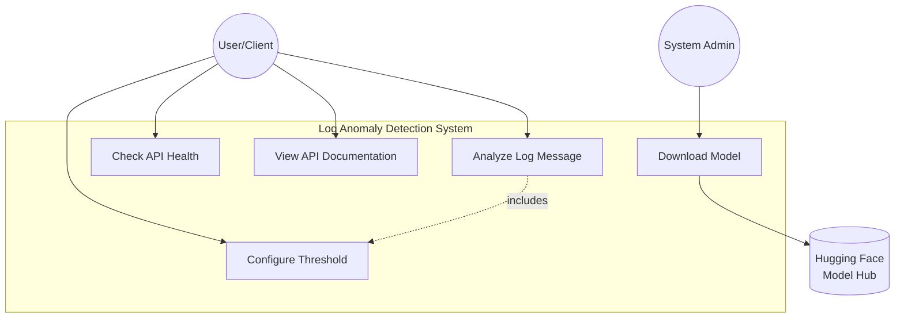

---

## 2. Sequence Diagram - Log Analysis Flow

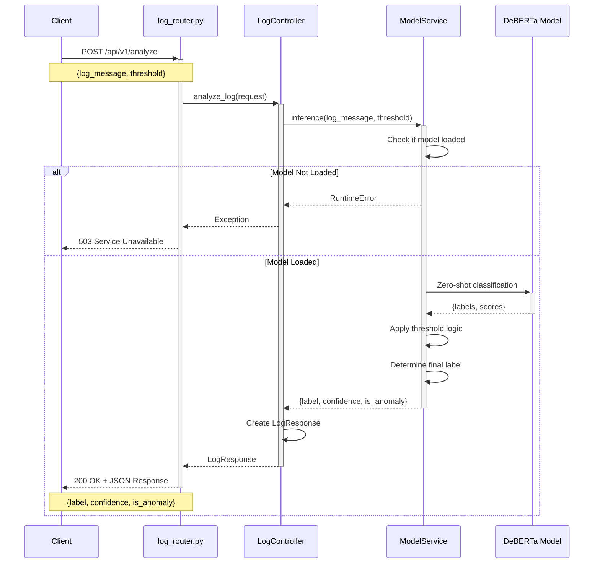

---

## 3. Sequence Diagram - Application Startup

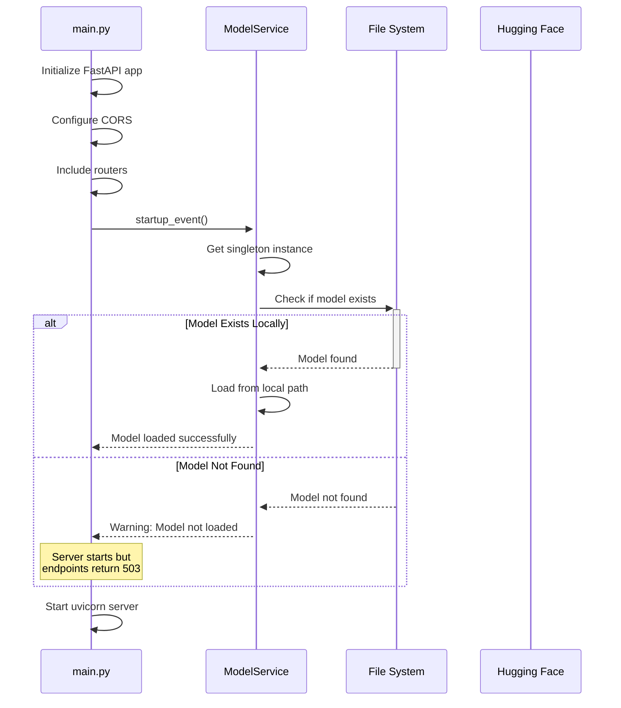

---

## 4. Data Flow Diagram (DFD) - Level 0 (Context Diagram)

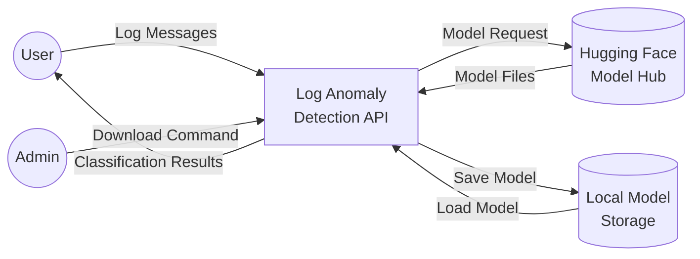

---

## 5. Data Flow Diagram (DFD) - Level 1

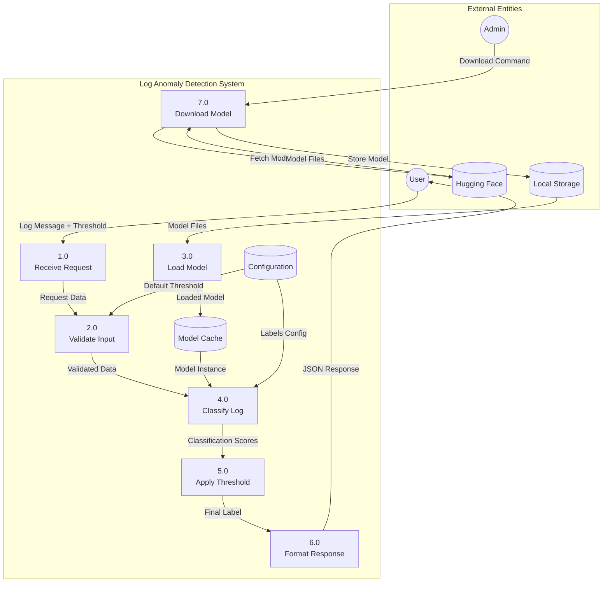

---

## 6. Component Diagram

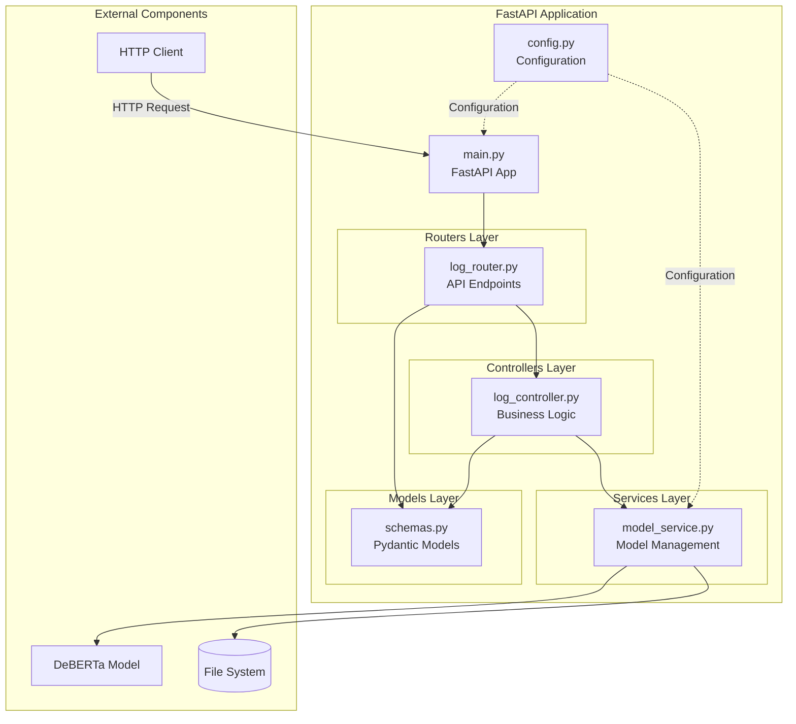

---

## 7. Class Diagram

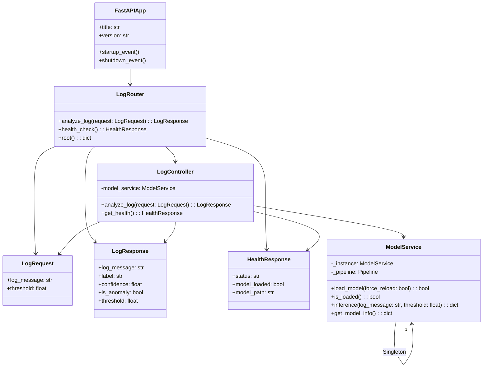

---

## 8. Deployment Diagram

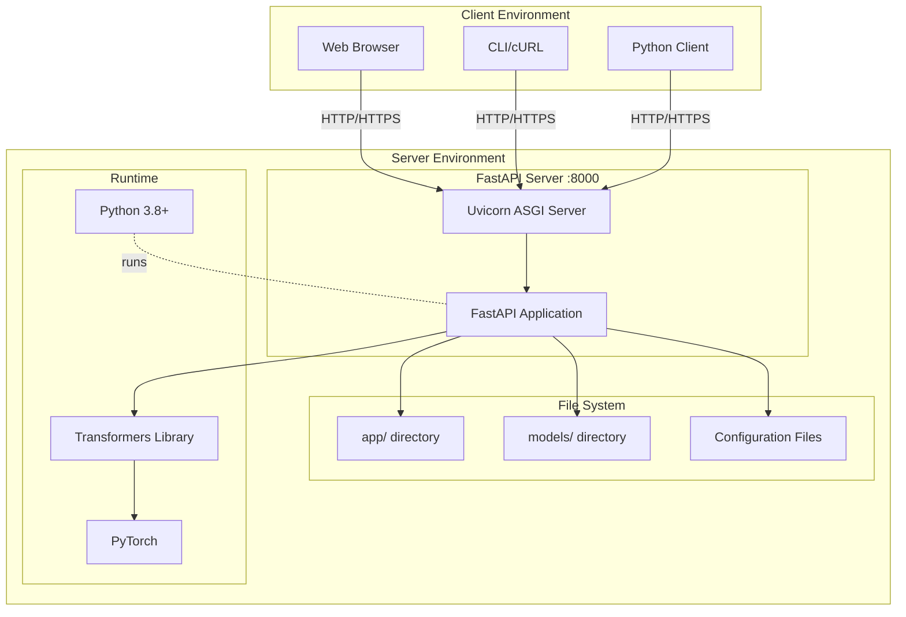

---

## 9. State Diagram - Model Service

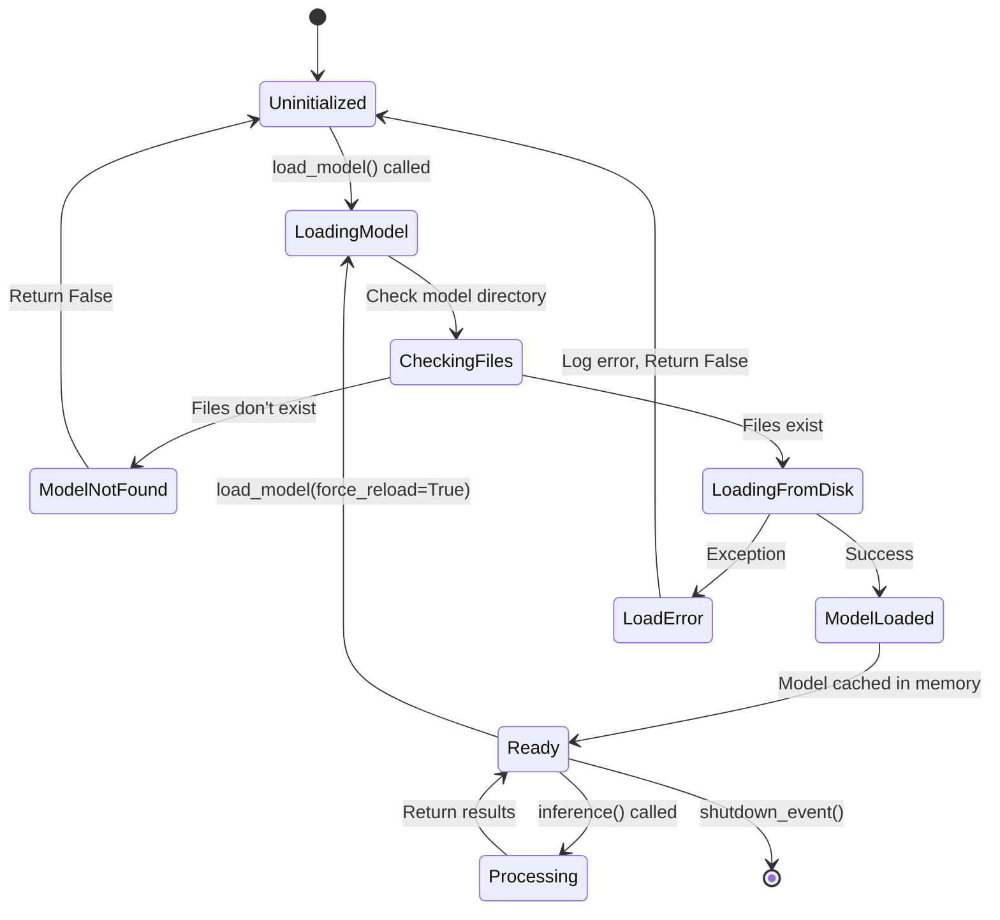

---

## 10. Activity Diagram - Log Analysis Process

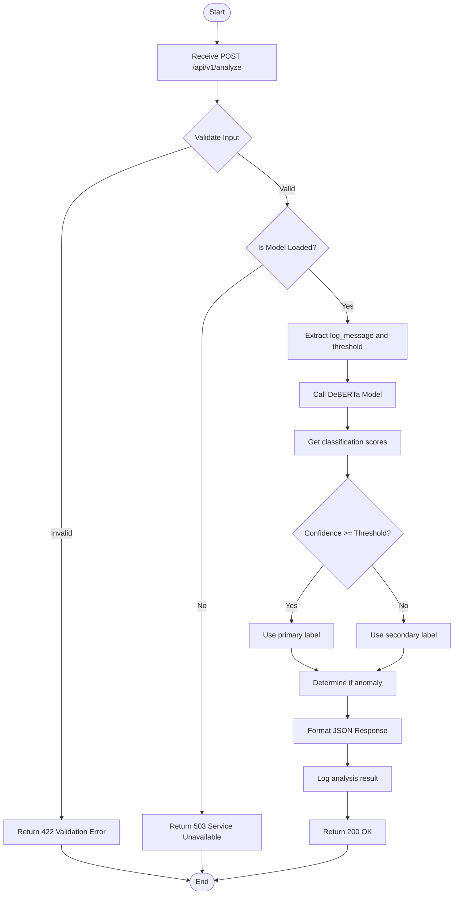

---

## 11. Architecture Diagram - MVC Pattern

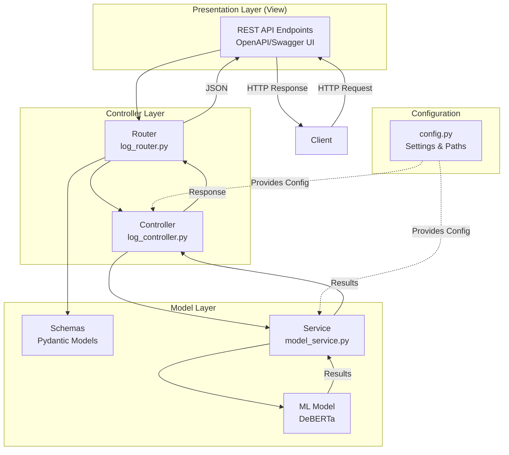

---

## 12. Entity Relationship Diagram - Data Model

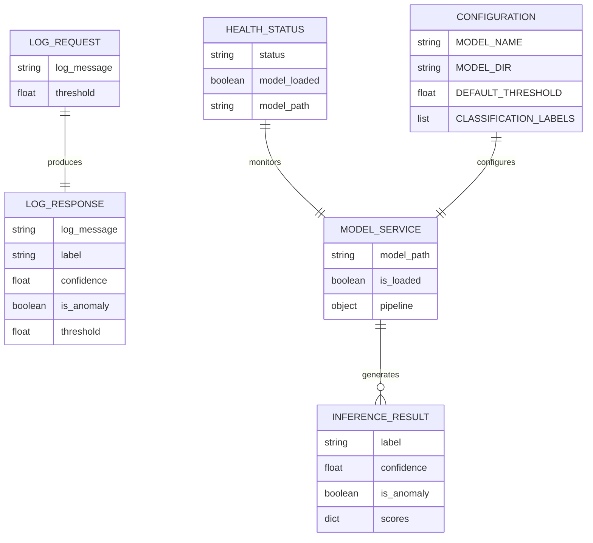

---

## 13. Network Diagram - API Communication

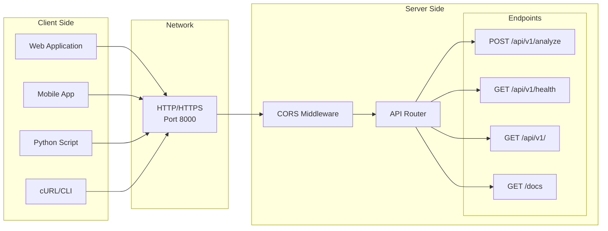

---

## 14. Flowchart - Model Download Process

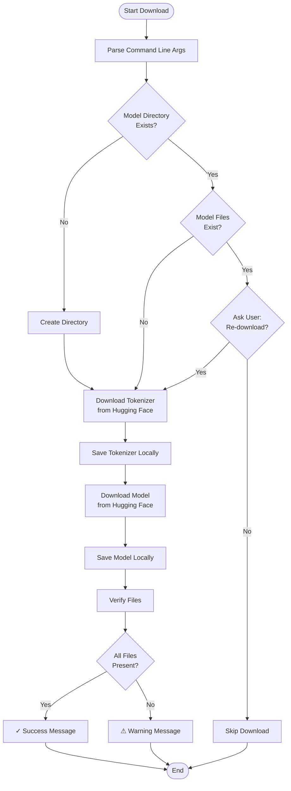

---

## Diagram Descriptions

### 1. **Use Case Diagram**
Shows the main interactions between users (clients and admins) and the system.

### 2. **Sequence Diagram - Log Analysis**
Illustrates the step-by-step flow when a client sends a log for analysis.

### 3. **Sequence Diagram - Startup**
Shows how the application initializes and loads the model on startup.

### 4. **DFD Level 0**
High-level view of data flow between external entities and the system.

### 5. **DFD Level 1**
Detailed view of internal processes and data stores.

### 6. **Component Diagram**
Shows the architectural components and their relationships.

### 7. **Class Diagram**
Displays the object-oriented structure of the application.

### 8. **Deployment Diagram**
Illustrates the physical deployment of the system.

### 9. **State Diagram**
Shows the different states of the ModelService throughout its lifecycle.

### 10. **Activity Diagram**
Details the workflow of analyzing a log message.

### 11. **Architecture Diagram**
Visualizes the MVC architecture pattern implementation.

### 12. **Entity Relationship Diagram**
Shows the data model and relationships between entities.

### 13. **Network Diagram**
Illustrates the network communication between clients and server.

### 14. **Flowchart**
Shows the model download process logic.

---

## How to View These Diagrams

### Option 1: GitHub/GitLab
Push this file to GitHub or GitLab - they render Mermaid diagrams automatically.

### Option 2: VS Code
Install the "Markdown Preview Mermaid Support" extension.

### Option 3: Online Editors
- [Mermaid Live Editor](https://mermaid.live/)
- Copy and paste individual diagrams

### Option 4: Documentation Tools
- MkDocs with mermaid plugin
- Docusaurus
- GitBook
